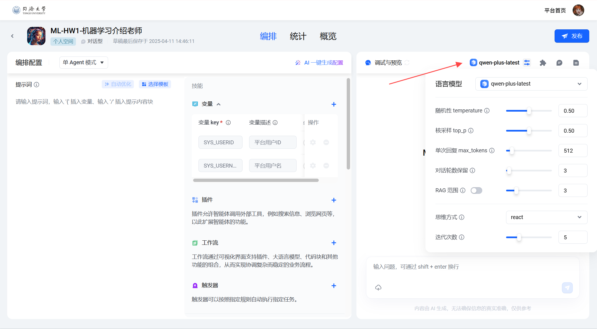
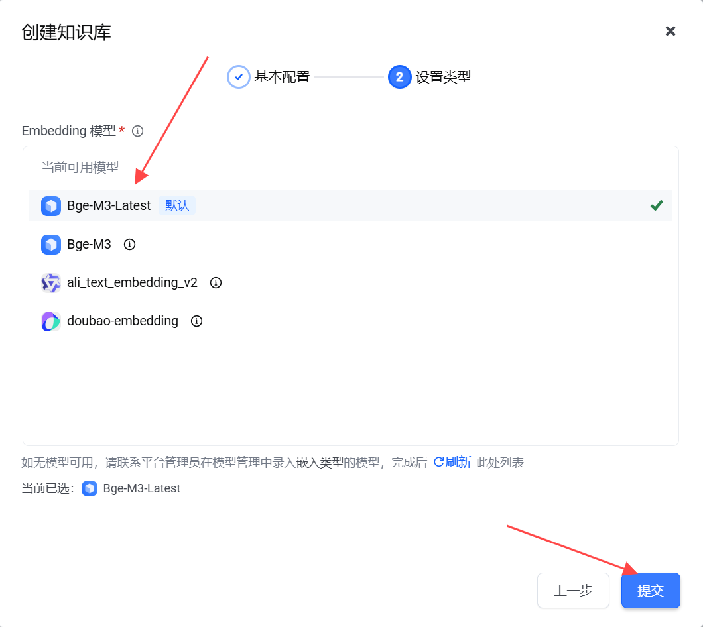

# HW1+2253744+林觉凯

>**Qustion1:** Explain what is supervised and unsupervised learning, and list two representative algorithms respectively.

In machine Learning, according to whether training data contains label information, Learning tasks can be generally divided into two categories: Supervised Learning and Unsupervised Learning.

**Supervised learning** refers to training with labeled data, i.e. each input sample corresponds to a known output result. The goal of the model is to learn a mapping function from these known input-output pairs, so that it can accurately predict the corresponding output when faced with a new input. Two common supervised learning algorithms:

+ **Linear Regression**: Used to model the linear relationship between input features and continuous output variables. By minimizing the error between the predicted value and the true value, an optimal regression line or hyperplane is fitted.
+ **Support Vector Machine (SVM)** : can be used for both classification and regression problems. SVM can find an optimal hyperplane in the feature space and separate samples of different classes at maximum intervals, thus improving the generalization ability of the model.

**Unsupervised learning** refers to training models on datasets that do not contain labeled outputs. Without explicit target values to guide the learning process, the model must autonomously explore and uncover the underlying structure, patterns, or relationships hidden within the data. Two common unsupervised learning algorithms:

+ **K-means Clustering** : A distance-based clustering algorithm used to divide data into a preset number of clusters. The goal is to minimize the differences between data points within a cluster while maximizing the differences between different clusters.
+ **Principal Component Analysis (PCA)** : It is a classical dimensionality reduction technique that maps high-dimensional features to low-dimensional Spaces through linear transformations while preserving as much original information as possible.


****

>**Qustion2:** For *K*-fold cross-validation, if *K* = the number of samples, it is called leave-one-out method. Suppose you have the following data: both input and output have only one variable. Use a linear regression model (*y = wx* *+ b*) to fit the data. So what is the mean squared error (MSE) obtained using Leave-One Out cross-validation?
>
>| X(independent variable) | Y(dependent variable) |
>| :---------------------: | :-------------------: |
>|            0            |           2           |
>|            2            |           2           |
>|            3            |           1           |

1. If $(0, 2)$ is the test sample, by fitting point $(2, 2)$ and $(3, 1)$ to the linear regression model, we can calculate:

   $w=-1, \ b=4,\ y=-x+4.$ 

   When $X = 0$, output $Y = 4$. But $Y_{actual1}=2.$

2. If $(2, 2)$ is the test sample, by fitting point $(0, 2)$ and $(3, 1)$ to the linear regression model, we can calculate:

   $w=- \frac{1}{3}, \ b=2,\ y=-\frac{1}{3}x+2.$ 

   When $X = 2$, output $Y = \frac{4}{3}$. But $Y_{actual2}=2.$

3. If $(3, 1)$ is the test sample, by fitting point $(0, 2)$ and $(2, 2)$ to the linear regression model, we can calculate:

   $w=0, \ b=2,\ y=2.$ 

   When $X = 3$, output $Y = 2$. But $Y_{actual3}=1.$

In conclusion, $MSE = \frac{1}{3} \sum_{i=1}^{3} \left( f(x_i) - y_i \right)^2=\frac {(4-2)^2 + (\frac{4}{3}-2)^2+(2-1)^2}{3}=\frac{49}{27}\approx 1.815$


**Code program for Question2:**

```python
import numpy as np
from sklearn.linear_model import LinearRegression
from sklearn.metrics import mean_squared_error
import matplotlib.pyplot as plt

X = np.array([0, 2, 3]).reshape(-1, 1)  
y = np.array([2, 2, 1])

# Define leave-one-out cross-validation function
def leave_one_out_cv(X, y):
    n = len(X)
    predictions = np.zeros(n)
    
    for i in range(n):
        # Training set: all samples except the i-th sample
        X_train = np.delete(X, i, axis=0)
        y_train = np.delete(y, i)
        
        # Test set: the i-th sample
        X_test = X[i].reshape(1, -1)
        
        model = LinearRegression()
        model.fit(X_train, y_train)
        
        # Predict the i-th sample and store the result
        predictions[i] = model.predict(X_test)[0]
        
        w = model.coef_[0]
        b = model.intercept_
        print(f"Model {i+1}: y = {w:.4f}x + {b:.4f}, Training data: X={X_train.flatten()}, y={y_train}")
        print(f"Prediction: X={X_test[0][0]}, Predicted value={predictions[i]:.4f}, Actual value={y[i]}")
        print("-" * 50)
    
    # Calculate MSE
    mse = mean_squared_error(y, predictions)
    return mse, predictions

mse, predictions = leave_one_out_cv(X, y)

print(f"Mean Squared Error (MSE) of leave-one-out cross-validation: {mse:.3f}")
```

**Program output for Question2:**

```bash
Model 1: y = -1.0000x + 4.0000, Training data: X=[2 3], y=[2 1]
Prediction: X=0, Predicted value=4.0000, Actual value=2
--------------------------------------------------
Model 2: y = -0.3333x + 2.0000, Training data: X=[0 3], y=[2 1]
Prediction: X=2, Predicted value=1.3333, Actual value=2
--------------------------------------------------
Model 3: y = 0.0000x + 2.0000, Training data: X=[0 2], y=[2 2]
Prediction: X=3, Predicted value=2.0000, Actual value=1
--------------------------------------------------
Mean Squared Error (MSE) of leave-one-out cross-validation: 1.815
```


****

> **Qustion3: **Let us take an example of actual demand and forecasted demand for a brand of ice creams in a shop in a year. In the table, M = Month, AD = Actual Demand, FD = Forecasted Demand. Please calculate the MAE(mean absolute error) and MSE(mean square error).
>
> | M      | 1    | 2    | 3    | 4    | 5    | 6    | 7    | 8    | 9    | 10   | 11   | 12   |
> | ------ | ---- | ---- | ---- | ---- | ---- | ---- | ---- | ---- | ---- | ---- | ---- | ---- |
> | **AD** | 42   | 45   | 49   | 55   | 57   | 60   | 62   | 58   | 54   | 50   | 44   | 40   |
> | **FD** | 44   | 46   | 48   | 50   | 55   | 60   | 64   | 60   | 53   | 48   | 42   | 38   |

$$
MAE = \frac{1}{12} \sum_{i=1}^{12} \left| AD_i- FD_i \right|=\frac{22}{12}=\frac{11}{6} \approx 1.833 \\
MSE=\frac{1}{12} \sum_{i=1}^{12} \left( AD_i- FD_i \right)^2=\frac{56}{12}=\frac{14}{3} \approx 4.667
$$

**Code program for Question3:**

```python
import numpy as np

actual_demand = np.array([42, 45, 49, 55, 57, 60, 62, 58, 54, 50, 44, 40])
forecast_demand = np.array([44, 46, 48, 50, 55, 60, 64, 60, 53, 48, 42, 38])

# Calculate MAE (Mean Absolute Error)
mae = np.mean(np.abs(actual_demand - forecast_demand))

# Calculate MSE (Mean Squared Error)
mse = np.mean((actual_demand - forecast_demand)**2)

print(f"MAE (Mean Absolute Error): {mae:.3f}")
print(f"MSE (Mean Squared Error): {mse:.3f}")
```

**Program output for Question3:**

```bash
MAE (Mean Absolute Error): 1.833
MSE (Mean Squared Error): 4.667
```


****

> **Question4: **Consider a triple classification problem that requires the recognition of three classes, A, B and C.
>
> Given the confusion matrix, please complete the following calculations.
>
> |               | A(Predict) | B(Predict) | C(Predict) |
> | :-----------: | :--------: | :--------: | :--------: |
> | **A(Actual)** |     40     |     20     |     10     |
> | **B(Actual)** |     35     |     85     |     40     |
> | **C(Actual)** |     0      |     10     |     20     |
>
> (1) Calculate the precision and recall for each class respectively.
>
> (2) Use both Macro-average and Weighted-average to calculate the precision and recall of the whole classifier. If you are not sure about these concepts, use a search engine. Retain 4 decimal places (only for (2))

(1) Calculate the precision and recall of $A$:

|        A         |    Predict A     |        Predict not A         |
| :--------------: | :--------------: | :--------------------------: |
|   **Actual A**   |     TP = 40      |      FN = 20 + 10 = 30       |
| **Actual not A** | FP = 35 + 0 = 35 | TN = 85 + 40 + 10 + 20 = 155 |

$$
precision = \frac{TP}{TP+FP}=\frac{40}{40+35}=\frac{40}{75}=\frac{8}{15} \approx 0.533\\
recall = \frac{TP}{TP+FN}=\frac{40}{40+30}=\frac{40}{70}=\frac{4}{7} \approx 0.571
$$

​     Calculate the precision and recall of $B$:

|        B         |     Predict B     |       Predict not B        |
| :--------------: | :---------------: | :------------------------: |
|   **Actual B**   |      TP = 85      |     FN = 35 + 40 = 75      |
| **Actual not B** | FP = 20 + 10 = 30 | TN = 40 + 10 + 0 + 20 = 70 |

$$
precision = \frac{TP}{TP+FP}=\frac{85}{85+30}=\frac{85}{115}=\frac{17}{23} \approx 0.739\\
recall = \frac{TP}{TP+FN}=\frac{85}{85+75}=\frac{85}{160}=\frac{17}{32} \approx 0.531
$$

​     Calculate the precision and recall of $C$:

|        C         |     Predict C     |        Predict not C         |
| :--------------: | :---------------: | :--------------------------: |
|   **Actual C**   |      TP = 20      |       FN = 0 + 10 = 10       |
| **Actual not C** | FP = 10 + 40 = 50 | TN = 40 + 20 + 35 + 85 = 180 |

$$
precision = \frac{TP}{TP+FP}=\frac{20}{20+50}=\frac{20}{70}=\frac{2}{7} \approx 0.286\\
recall = \frac{TP}{TP+FN}=\frac{20}{20+10}=\frac{20}{30}=\frac{2}{3} \approx 0.667
$$

(2) Macro-average: A simple average is calculated for the indicators in each category, with equal weight for each category.
$$
{Macro_{Precision}} = \frac{1}{3} \sum_{i=1}^{3} {Precision}_i=\frac{\frac{8}{15}+\frac{17}{23}+\frac{2}{7}}{3} \approx 0.5194\\

{Macro_{Recall}} = \frac{1}{3} \sum_{i=1}^{3} {Recall}_i=\frac{\frac{4}{7}+\frac{17}{32}+\frac{2}{3}}{3}\approx 0.5898
$$
Weighted-average:Weighted by the number of real samples in each category, categories with more samples have higher weights.
$$
{Weighted_{Precision}} = \sum_{i=1}^{3} \frac{n_i}{N} \cdot {Precision}_i=\frac{70}{260} \cdot\frac{8}{15}+\frac{160}{260} \cdot\frac{17}{23}+\frac{30}{260} \cdot\frac{2}{7} \approx 0.6314\\

{Weighted_{Recall}} = \sum_{i=1}^{3} \frac{n_i}{N} \cdot {Recall}_i=\frac{70}{260} \cdot\frac{4}{7}+\frac{160}{260} \cdot\frac{17}{32}+\frac{30}{260} \cdot\frac{2}{3} \approx 0.5577
$$


**Code program for Question4:**

```python
import numpy as np

# Define the confusion matrix
confusion_matrix = np.array([
    [40, 20, 10],  # Actual A
    [35, 85, 40],  # Actual B
    [0, 10, 20]    # Actual C
])

# Calculate class-wise metrics
def calculate_metrics(confusion_matrix):
    num_classes = confusion_matrix.shape[0]
    precision = np.zeros(num_classes)
    recall = np.zeros(num_classes)
    class_counts = np.sum(confusion_matrix, axis=1)  
    total_samples = np.sum(class_counts)
    
    for i in range(num_classes):
        # Precision: TP / (TP + FP) = diagonal value / column sum
        precision[i] = confusion_matrix[i, i] / np.sum(confusion_matrix[:, i])
        
        # Recall: TP / (TP + FN) = diagonal value / row sum
        recall[i] = confusion_matrix[i, i] / np.sum(confusion_matrix[i, :])
    
    # Macro average (simple average of all classes)
    macro_precision = np.mean(precision)
    macro_recall = np.mean(recall)
    
    # Weighted average (weighted by class counts)
    weighted_precision = np.sum(precision * class_counts) / total_samples
    weighted_recall = np.sum(recall * class_counts) / total_samples
    
    return precision, recall, macro_precision, macro_recall, weighted_precision, weighted_recall, class_counts

# Get results
precision, recall, macro_precision, macro_recall, weighted_precision, weighted_recall, class_counts = calculate_metrics(confusion_matrix)

# Output results
class_names = ['A', 'B', 'C']
for i, name in enumerate(class_names):
    print(f"Class {name}:")
    print(f"  Precision: {precision[i]:.3f}")
    print(f"  Recall: {recall[i]:.3f}")

print("\nOverall metrics:")
print(f"  Macro-average Precision: {macro_precision:.4f}")
print(f"  Macro-average Recall: {macro_recall:.4f}")
print(f"  Weighted-average Precision: {weighted_precision:.4f}")
print(f"  Weighted-average Recall: {weighted_recall:.4f}")
```

**Program output for Question4:**

```bash
Class A:
  Precision: 0.533
  Recall: 0.571
Class B:
  Precision: 0.739
  Recall: 0.531
Class C:
  Precision: 0.286
  Recall: 0.667

Overall metrics:
  Macro-average Precision: 0.5194
  Macro-average Recall: 0.5898
  Weighted-average Precision: 0.6314
  Weighted-average Recall: 0.5577
```


****

> **Question5: **Try to implement an agent with practical application value on Tongji AI. Provide an introduction to its functions and screenshots of its application.

First of all, visit https://agent.tongji.edu.cn:


Click on "我的智能体" and then "创建智能体". We can enter the agent name and function description:


Click Select Model, the default model selected is qwen-plus-latest:

<p align="center">
  
  
</p>

Go to the page, find the knowledge base, and click the plus sign on the right:


Next, do some basic configuration (knowledge base name and description) and set the model type (Bge-M3-Latest in my case):

<p align="center">
  
  
</p>

The next step is to import the files from the knowledge base:


We select local upload, then upload the files we need, and then click Next:


Here we can see the uploaded file parsing success. Then click on the relevant file to view and edit the relevant snippet:


Then we go back to the original page and add the knowledge base we uploaded and parsed earlier on the introduction to machine learning:


<p align="center">
  
  
</p>


Next, I can continue to ask questions, and the subsequent questions can be answered according to the relevant knowledge in this knowledge base:

The knowledge base agent I built is the introduction teacher for machine learning. It is based on the content of the first PPT of our course, so I can ask him some basic questions about machine learning and related questions about our course content.

+ My Knowledge Base Agent Functions:
  + **Provide introductory information about machine learning. **Users can ask the system to learn basic concepts and gain a better understanding of machine learning for assisted study.
  + **Offer details about the machine learning course, including class schedule, location, and assessment methods.** If students forget any of this information, they can simply ask the system for a quick reminder.
  + **Provide a summary of the first lecture and highlight the key points.** This helps students review and reinforce what they have learned after class.


We can see that the questions I asked about the introduction to machine learning and the content of the course were well answered by the agent, the introduction to machine learning made a lot of sense, and some of the content and information about our course were well answered. This is really our study and work useful little assistant!