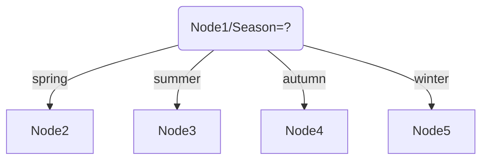
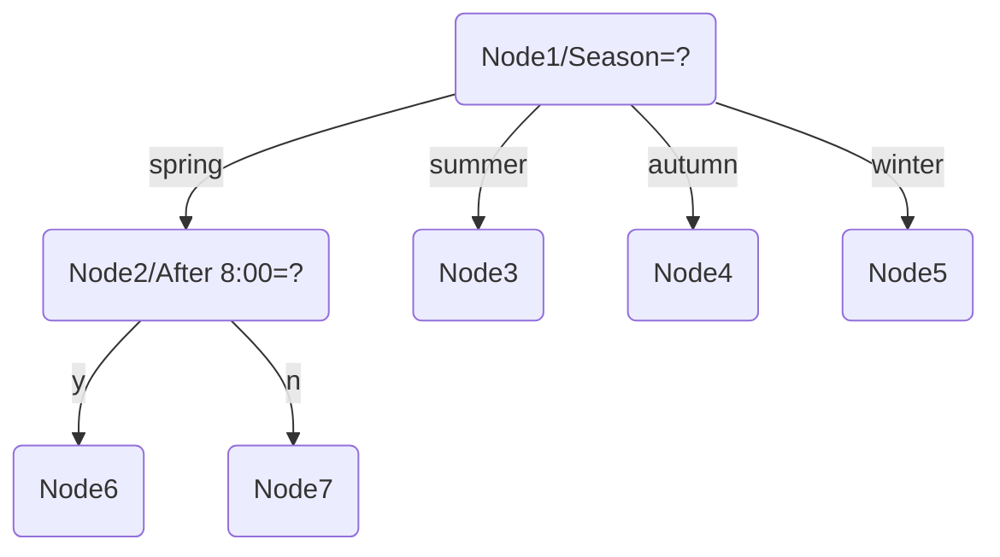
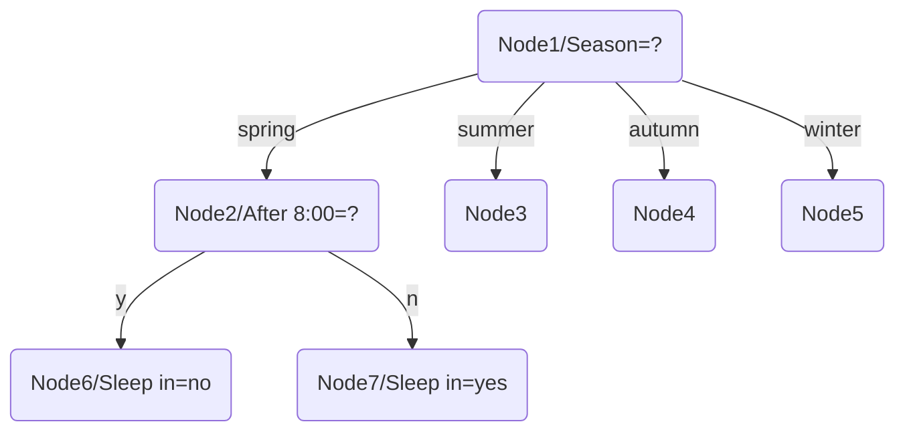
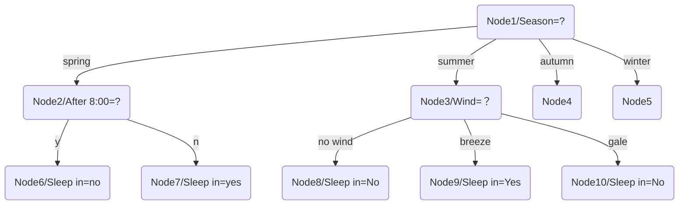
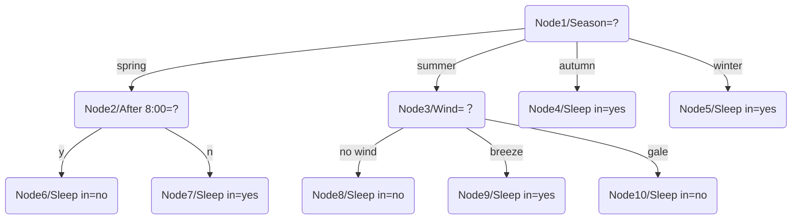

# HW2+2253744+林觉凯

> **Question 1:** Calculate the gradient of the following multivariate function:
>
> (1) $u=xy+y^2+5$
>
> (2) $u=ln\sqrt{x^2+y^2+z^2}$，at (1, 2, -2)

(1) Calculate the gradient of the following multivariate function $u=xy+y^2+5$ :
$$
\because \frac{\partial u}{\partial x}=y,
\frac{\partial u}{\partial y}=x+2y\\
\therefore \nabla u=(y,x+2y)
$$
(2) Calculate the gradient of the following multivariate function $u=ln\sqrt{x^2+y^2+z^2}$ :
$$
\frac{\partial u}{\partial x}=\frac{1}{2}\times\frac{1}{x^2+y^2+z^2}\times2x=\frac{x}{{x^2+y^2+z^2}} \\
\frac{\partial u}{\partial y}=\frac{1}{2}\times\frac{1}{x^2+y^2+z^2}\times2y=\frac{y}{{x^2+y^2+z^2}}\\
\frac{\partial u}{\partial z}=\frac{1}{2}\times\frac{1}{x^2+y^2+z^2}\times2z=\frac{z}{{x^2+y^2+z^2}}\\
\nabla u=(\frac{x}{{x^2+y^2+z^2}} ,\frac{y}{{x^2+y^2+z^2}} ,\frac{z}{{x^2+y^2+z^2}})\\
\therefore \nabla u_{(1,2,-2)}=(\frac{\partial u}{\partial x},\frac{\partial u}{\partial y},\frac{\partial u}{\partial z})_{(1,2,-2)}=(\frac{1}{9},\frac{2}{9},-\frac{2}{9})
$$
**Code program for Question1:**

```python
import numpy as np
import sympy as sp

def calculate_gradient_1():
    """Calculate the gradient of the function u = xy + y^2 + 5"""
    x, y = sp.symbols('x y')
    u = x*y + y**2 + 5
    
    # Calculate partial derivatives
    du_dx = sp.diff(u, x)
    du_dy = sp.diff(u, y)
    
    print("Gradient of the function u = xy + y^2 + 5:")
    print(f"∂u/∂x = {du_dx}")
    print(f"∂u/∂y = {du_dy}")
    print(f"Gradient ∇u = ({du_dx}, {du_dy})")
    
def calculate_gradient_2():
    """Calculate the gradient of the function u = ln(sqrt(x^2 + y^2 + z^2)) at the point (1, 2, -2)"""
    x, y, z = sp.symbols('x y z')
    u = sp.log(sp.sqrt(x**2 + y**2 + z**2))
    
    # Calculate partial derivatives
    du_dx = sp.diff(u, x)
    du_dy = sp.diff(u, y)
    du_dz = sp.diff(u, z)
    
    # Calculate the gradient at the point (1, 2, -2)
    point = {x: 1, y: 2, z: -2}
    grad_x_value = du_dx.subs(point)
    grad_y_value = du_dy.subs(point)
    grad_z_value = du_dz.subs(point)
    
    # Calculate the length of the vector
    vector_length = sp.sqrt(x**2 + y**2 + z**2).subs(point)
    
    print("\nGradient of the function u = ln(sqrt(x^2 + y^2 + z^2)) at the point (1, 2, -2):")
    print(f"∂u/∂x at (1, 2, -2) = {grad_x_value}")
    print(f"∂u/∂y at (1, 2, -2) = {grad_y_value}")
    print(f"∂u/∂z at (1, 2, -2) = {grad_z_value}")
    print(f"Gradient ∇u at (1, 2, -2) = ({grad_x_value}, {grad_y_value}, {grad_z_value})")
    
    # Numerical results (converted to float)
    print("\nNumerical results:")
    print(f"∇u at (1, 2, -2) = ({float(grad_x_value)}, {float(grad_y_value)}, {float(grad_z_value)})")

if __name__ == "__main__":
    calculate_gradient_1()
    calculate_gradient_2()
```

**Program output for Question1:**

```bash
Gradient of the function u = xy + y^2 + 5:
∂u/∂x = y
∂u/∂y = x + 2*y
Gradient ∇u = (y, x + 2*y)

Gradient of the function u = ln(sqrt(x^2 + y^2 + z^2)) at the point (1, 2, -2):
∂u/∂x at (1, 2, -2) = 1/9
∂u/∂y at (1, 2, -2) = 2/9
∂u/∂z at (1, 2, -2) = -2/9
Gradient ∇u at (1, 2, -2) = (1/9, 2/9, -2/9)

Numerical results:
∇u at (1, 2, -2) = (0.1111111111111111, 0.2222222222222222, -0.2222222222222222)
```


****

> **Question 2:** As we all know, whether to sleep in is a complex question that depends on multiple variables. The following is a random selection of student A's 12-day data on sleeping in. Please build a decision tree based on this data, and use the information gain to divide the attributes. An illustration of the calculation process and the final decision tree is required. Hint: For some nodes, you may not need to calculate conditional entropy, but directly make decision by observing the data.
>
> | Season | After 8:00 |  Wind   | Sleep in |
> | :----: | :--------: | :-----: | :------: |
> | spring |     no     | breeze  |   yes    |
> | winter |     no     | no wind |   yes    |
> | autumn |    yes     | breeze  |   yes    |
> | winter |     no     | no wind |   yes    |
> | summer |     no     | breeze  |   yes    |
> | winter |    yes     | breeze  |   yes    |
> | winter |     no     |  gale   |   yes    |
> | winter |     no     | no wind |   yes    |
> | spring |    yes     | no wind |    no    |
> | summer |    yes     |  gale   |    no    |
> | summer |     no     |  gale   |    no    |
> | autumn |    yes     | breeze  |   yes    |
>
> (P.S. Sleeping in is not a good habit)

The two main formulas on the PPT:

$$
\operatorname{Ent}(D)=-\sum_{k=1}^{|\mathcal{Y}|} p_k \log _2 p_k \\
\operatorname{Gain}(D, a)=\operatorname{Ent}(D)-\sum_{v=1}^V \frac{\left|D^v\right|}{|D|} \operatorname{Ent}\left(D^v\right)
$$
For the Node1, calculate:
$$
Ent(D)=-\sum_{k=1}^{|\mathcal{Y}|} p_k \log _2 p_k=-\frac{3}{12}log_2(\frac{3}{12})-\frac{9}{12}log_2(\frac{9}{12})=0.8113
$$
For the attribute **season**: 
$$
\sum_{v=1}^V \frac{\left|D^v\right|}{|D|}\operatorname{Ent}\left(D^v\right)=
\frac{2}{12}
(
-\frac{1}{2}log_2(\frac{1}{2})
-\frac{1}{2}log_2(\frac{1}{2})
)

+
\frac{3}{12}
(
-\frac{2}{3}log_2(\frac{2}{3})
-\frac{1}{3}log_2(\frac{1}{3})
)
\\
+
\frac{2}{12}
(-\frac{2}{2}log_2(\frac{2}{2}))
+
\frac{5}{12}
(-\frac{5}{5}log_2(\frac{5}{5}))
\\
=\frac{2}{12}\times1+\frac{3}{12}\times 0.9183+\frac{2}{12}\times 0+\frac{5}{12}\times 0=0.3962\\
gain(Season)=\operatorname{Ent}(D)-\sum_{v=1}^V \frac{\left|D^v\right|}{|D|}\operatorname{Ent}\left(D^v\right)=0.4151
$$
For the attribute **After 8:00**: 
$$
\sum_{v=1}^V \frac{\left|D^v\right|}{|D|}\operatorname{Ent}\left(D^v\right)=\frac{7}{12}
(-\frac{1}{7}log_2(\frac{1}{7})
-\frac{6}{7}log_2(\frac{6}{7})
)+
\frac{5}{12}
(-\frac{2}{5}log_2(\frac{2}{5})
-\frac{3}{5}log_2(\frac{3}{5})
)
\\
=\frac{7}{12}\times0.5917+\frac{5}{12}\times 0.9710
=0.7497\\
gain(After\ 8:00)=\operatorname{Ent}(D)-\sum_{v=1}^V \frac{\left|D^v\right|}{|D|}\operatorname{Ent}\left(D^v\right)=0.0616
$$
For the attribute **Wind**: 
$$
\sum_{v=1}^V \frac{\left|D^v\right|}{|D|}\operatorname{Ent}\left(D^v\right)=

\frac{4}{12}
(-\frac{1}{4}log_2(\frac{1}{4})
-\frac{3}{4}log_2(\frac{3}{4}))
+
\frac{5}{12}
(-\frac{5}{5}log_2(\frac{5}{5}))
+
\frac{3}{12}
(-\frac{2}{3}log_2(\frac{2}{3})
-\frac{1}{3}log_2(\frac{1}{3})
)
\\
=\frac{4}{12}\times 0.8113+\frac{5}{12}\times 0+\frac{3}{12}\times 0.9183

=0.5\\
gain(Wind)=\operatorname{Ent}(D)-\sum_{v=1}^V \frac{\left|D^v\right|}{|D|}\operatorname{Ent}\left(D^v\right)=0.3113
$$
$0.4151>0.3113>0.0616$, so Season is chosen as root.



For the Node2, calculate:
$$
Ent(D)=-\frac{1}{2}log_2(\frac{1}{2})
-\frac{1}{2}log_2(\frac{1}{2})=1
$$
For the attribute **After 8:00**:
$$
\sum_{v=1}^V \frac{\left|D^v\right|}{|D|}\operatorname{Ent}\left(D^v\right)=
\frac{1}{2}
(-\frac{1}{1}log_2(\frac{1}{1}))
+
\frac{1}{2}
(-\frac{1}{1}log_2(\frac{1}{1}))
=0\\gain(After\ 8:00)=\operatorname{Ent}(D)-\sum_{v=1}^V \frac{\left|D^v\right|}{|D|}\operatorname{Ent}\left(D^v\right)=1.000
$$
For the attribute **Wind**: 
$$
\sum_{v=1}^V \frac{\left|D^v\right|}{|D|}\operatorname{Ent}\left(D^v\right)=
\frac{1}{2}
(-\frac{1}{1}log_2(\frac{1}{1}))
+
\frac{1}{2}
(-\frac{1}{1}log_2(\frac{1}{1}))
=0\\gain(Wind)=\operatorname{Ent}(D)-\sum_{v=1}^V \frac{\left|D^v\right|}{|D|}\operatorname{Ent}\left(D^v\right)=1.000
$$
$1.000=1.000,$ We can choose both of them. Here I choose attribute **After 8:00** with gain 1.000.



For Node6 and Node7, we can observe that all target_values have the same value. So Node6 Sleep in = no and Node7 Sleep in = yes.



For the Node3, calculate:
$$
Ent(D)=-\frac{2}{3}log_2(\frac{2}{3})
-\frac{1}{3}log_2(\frac{1}{3})=0.9183
$$
For the attribute **After 8:00**:
$$
\sum_{v=1}^V \frac{\left|D^v\right|}{|D|}\operatorname{Ent}\left(D^v\right)=
\frac{2}{3}
(-\frac{1}{2}log_2(\frac{1}{2})
-\frac{1}{2}log_2(\frac{1}{2}))
+
\frac{1}{3}
(-\frac{1}{1}log_2(\frac{1}{1}))
=\frac{2}{3}\times1+\frac{1}{3}\times 0=0.6667\\gain(After\ 8:00)=\operatorname{Ent}(D)-\sum_{v=1}^V \frac{\left|D^v\right|}{|D|}\operatorname{Ent}\left(D^v\right)=0.2516
$$
For the attribute **Wind**: 
$$
\sum_{v=1}^V \frac{\left|D^v\right|}{|D|}\operatorname{Ent}\left(D^v\right)=
\frac{1}{3}
(-\frac{1}{1}log_2(\frac{1}{1}))
+
\frac{2}{3}
(-\frac{2}{2}log_2(\frac{2}{2}))
=0\\gain(Wind)=\operatorname{Ent}(D)-\sum_{v=1}^V \frac{\left|D^v\right|}{|D|}\operatorname{Ent}\left(D^v\right)=0.9183
$$
$0.9183>0.2516$ So I choose attribute **Wind** with gain 1.000.

Because $D_{No\ wind}$ is empty, Node8 is marked as the class in $D$ with largest proportion: no.

For Node9 and Node10, we can observe that all target_values have the same value. So Node9 Sleep in = yes and Node10 Sleep in = no.



For Node4 and Node5, we can observe that all target_values have the same value. So Node4 Sleep in = yes and Node5 Sleep in = yes. So, the final decision tree structure is:



**Code program for Question2:**

```python
import pandas as pd
import numpy as np
import math
import matplotlib.pyplot as plt
import matplotlib.patches as mpatches

# Calculate information entropy
def calculate_entropy(data_labels):
    """Calculate information entropy
    Args:
        data_labels: List of sample labels
    Returns:
        entropy: Information entropy
    """
    # Get unique values and counts of labels
    unique_labels, counts = np.unique(data_labels, return_counts=True)
    # Calculate probabilities
    probabilities = counts / len(data_labels)
    # Calculate entropy
    entropy = 0
    for p in probabilities:
        entropy -= p * math.log2(p) if p > 0 else 0
    return entropy

# Calculate conditional entropy of a feature
def calculate_conditional_entropy(feature_values, labels):
    """Calculate conditional entropy
    Args:
        feature_values: List of feature values
        labels: Corresponding list of labels
    Returns:
        conditional_entropy: Conditional entropy
    """
    # Get unique feature values
    unique_values = np.unique(feature_values)
    conditional_entropy = 0
    
    # Calculate entropy for each feature value, weighted sum
    for value in unique_values:
        # Get indices of samples with current feature value
        indices = np.where(feature_values == value)[0]
        # Proportion of samples with current feature value
        proportion = len(indices) / len(labels)
        # Labels corresponding to current feature value
        subset_labels = [labels[i] for i in indices]
        # Calculate entropy for current feature value
        entropy = calculate_entropy(subset_labels)
        # Weighted sum
        conditional_entropy += proportion * entropy
        
    return conditional_entropy

# Calculate information gain
def calculate_gain(feature_values, labels):
    """Calculate information gain
    Args:
        feature_values: List of feature values
        labels: Corresponding list of labels
    Returns:
        gain: Information gain
    """
    # Calculate information entropy of dataset
    entropy = calculate_entropy(labels)
    # Calculate conditional entropy
    conditional_entropy = calculate_conditional_entropy(feature_values, labels)
    # Calculate information gain
    gain = entropy - conditional_entropy
    return gain, conditional_entropy

def process_data():
    """Process data, build decision tree as required"""
    # Create dataset
    data = {
        'Season': ['spring', 'winter', 'autumn', 'winter', 'summer', 'winter', 'winter', 'winter', 'spring', 'summer', 'summer', 'autumn'],
        'After 8:00': ['no', 'no', 'yes', 'no', 'no', 'yes', 'no', 'no', 'yes', 'yes', 'no', 'yes'],
        'Wind': ['breeze', 'no wind', 'breeze', 'no wind', 'breeze', 'breeze', 'gale', 'no wind', 'no wind', 'gale', 'gale', 'breeze'],
        'Sleep in': ['yes', 'yes', 'yes', 'yes', 'yes', 'yes', 'yes', 'yes', 'no', 'no', 'no', 'yes']
    }
    
    # Convert to DataFrame for easier operations
    df = pd.DataFrame(data)
    
    # Print dataset
    print("Dataset:")
    print(df)
    print("\n")
    
    # Extract labels
    labels = df['Sleep in'].values
    
    # Calculate information entropy of dataset
    dataset_entropy = calculate_entropy(labels)
    print(f"Calculate information entropy of dataset:")
    print(f"Ent(D) = -{9/12}*log2({9/12}) - {3/12}*log2({3/12}) = {dataset_entropy:.4f}")
    
    # Calculate information gain for each feature, select best splitting feature
    feature_names = ['Season', 'After 8:00', 'Wind']
    gains = []
    conditional_entropies = []
    
    # Node 1 splitting calculation
    print("\nCalculate Node 1 splitting:")
    
    # Season feature
    season_values = df['Season'].values
    season_gain, season_conditional_entropy = calculate_gain(season_values, labels)
    gains.append(season_gain)
    conditional_entropies.append(season_conditional_entropy)
    
    # Detailed calculation process for Season
    print("\na=Season:")
    
    # Get unique values and counts for Season
    unique_seasons, season_counts = np.unique(season_values, return_counts=True)
    season_details = []
    
    for i, season in enumerate(unique_seasons):
        indices = np.where(season_values == season)[0]
        subset_labels = [labels[j] for j in indices]
        yes_count = subset_labels.count('yes')
        no_count = subset_labels.count('no')
        total = len(subset_labels)
        
        # Calculate entropy for current feature value
        if total > 0:
            if yes_count == total or no_count == total:  # Pure node
                entropy = 0
            else:
                p_yes = yes_count / total
                p_no = no_count / total
                entropy = -p_yes * math.log2(p_yes) - p_no * math.log2(p_no)
        else:
            entropy = 0
            
        season_details.append({
            'value': season,
            'count': total,
            'yes_count': yes_count,
            'no_count': no_count,
            'entropy': entropy
        })
        
        # Print calculation process
        print(f"  Season = {season}:")
        print(f"    Samples: {total}, yes: {yes_count}, no: {no_count}")
        if total > 0:
            if yes_count == total:
                print(f"    Entropy = -({yes_count}/{total})log2({yes_count}/{total}) = {entropy:.4f}")
            elif no_count == total:
                print(f"    Entropy = -({no_count}/{total})log2({no_count}/{total}) = {entropy:.4f}")
            else:
                print(f"    Entropy = -({yes_count}/{total})log2({yes_count}/{total}) - ({no_count}/{total})log2({no_count}/{total}) = {entropy:.4f}")
        else:
            print(f"    Entropy = 0")
    
    # Calculate conditional entropy
    season_conditional_entropy_calculation = ""
    for detail in season_details:
        value = detail['value']
        count = detail['count']
        entropy = detail['entropy']
        season_conditional_entropy_calculation += f"({count}/12) * {entropy:.4f} + "
    
    season_conditional_entropy_calculation = season_conditional_entropy_calculation.rstrip(" + ")
    print(f"\n  Conditional Entropy = {season_conditional_entropy_calculation} = {season_conditional_entropy:.4f}")
    print(f"  Information Gain = {dataset_entropy:.4f} - {season_conditional_entropy:.4f} = {season_gain:.4f}")
    
    # After 8:00 feature
    after_8_values = df['After 8:00'].values
    after_8_gain, after_8_conditional_entropy = calculate_gain(after_8_values, labels)
    gains.append(after_8_gain)
    conditional_entropies.append(after_8_conditional_entropy)
    
    # Detailed calculation process for After 8:00
    print("\na=After 8:00:")
    
    # Get unique values and counts for After 8:00
    unique_after_8, after_8_counts = np.unique(after_8_values, return_counts=True)
    after_8_details = []
    
    for i, after_8 in enumerate(unique_after_8):
        indices = np.where(after_8_values == after_8)[0]
        subset_labels = [labels[j] for j in indices]
        yes_count = subset_labels.count('yes')
        no_count = subset_labels.count('no')
        total = len(subset_labels)
        
        # Calculate entropy for current feature value
        if total > 0:
            if yes_count == total or no_count == total:  # Pure node
                entropy = 0
            else:
                p_yes = yes_count / total
                p_no = no_count / total
                entropy = -p_yes * math.log2(p_yes) - p_no * math.log2(p_no)
        else:
            entropy = 0
            
        after_8_details.append({
            'value': after_8,
            'count': total,
            'yes_count': yes_count,
            'no_count': no_count,
            'entropy': entropy
        })
        
        # Print calculation process
        print(f"  After 8:00 = {after_8}:")
        print(f"    Samples: {total}, yes: {yes_count}, no: {no_count}")
        if total > 0:
            if yes_count == total:
                print(f"    Entropy = -({yes_count}/{total})log2({yes_count}/{total}) = {entropy:.4f}")
            elif no_count == total:
                print(f"    Entropy = -({no_count}/{total})log2({no_count}/{total}) = {entropy:.4f}")
            else:
                print(f"    Entropy = -({yes_count}/{total})log2({yes_count}/{total}) - ({no_count}/{total})log2({no_count}/{total}) = {entropy:.4f}")
        else:
            print(f"    Entropy = 0")
    
    # Calculate conditional entropy
    after_8_conditional_entropy_calculation = ""
    for detail in after_8_details:
        value = detail['value']
        count = detail['count']
        entropy = detail['entropy']
        after_8_conditional_entropy_calculation += f"({count}/12) * {entropy:.4f} + "
    
    after_8_conditional_entropy_calculation = after_8_conditional_entropy_calculation.rstrip(" + ")
    print(f"\n  Conditional Entropy = {after_8_conditional_entropy_calculation} = {after_8_conditional_entropy:.4f}")
    print(f"  Information Gain = {dataset_entropy:.4f} - {after_8_conditional_entropy:.4f} = {after_8_gain:.4f}")
    
    # Wind feature
    wind_values = df['Wind'].values
    wind_gain, wind_conditional_entropy = calculate_gain(wind_values, labels)
    gains.append(wind_gain)
    conditional_entropies.append(wind_conditional_entropy)
    
    # Detailed calculation process for Wind
    print("\na=Wind:")
    
    # Get unique values and counts for Wind
    unique_winds, wind_counts = np.unique(wind_values, return_counts=True)
    wind_details = []
    
    for i, wind in enumerate(unique_winds):
        indices = np.where(wind_values == wind)[0]
        subset_labels = [labels[j] for j in indices]
        yes_count = subset_labels.count('yes')
        no_count = subset_labels.count('no')
        total = len(subset_labels)
        
        # Calculate entropy for current feature value
        if total > 0:
            if yes_count == total or no_count == total:  # Pure node
                entropy = 0
            else:
                p_yes = yes_count / total
                p_no = no_count / total
                entropy = -p_yes * math.log2(p_yes) - p_no * math.log2(p_no)
        else:
            entropy = 0
            
        wind_details.append({
            'value': wind,
            'count': total,
            'yes_count': yes_count,
            'no_count': no_count,
            'entropy': entropy
        })
        
        # Print calculation process
        print(f"  Wind = {wind}:")
        print(f"    Samples: {total}, yes: {yes_count}, no: {no_count}")
        if total > 0:
            if yes_count == total:
                print(f"    Entropy = -({yes_count}/{total})log2({yes_count}/{total}) = {entropy:.4f}")
            elif no_count == total:
                print(f"    Entropy = -({no_count}/{total})log2({no_count}/{total}) = {entropy:.4f}")
            else:
                print(f"    Entropy = -({yes_count}/{total})log2({yes_count}/{total}) - ({no_count}/{total})log2({no_count}/{total}) = {entropy:.4f}")
        else:
            print(f"    Entropy = 0")
    
    # Calculate conditional entropy
    wind_conditional_entropy_calculation = ""
    for detail in wind_details:
        value = detail['value']
        count = detail['count']
        entropy = detail['entropy']
        wind_conditional_entropy_calculation += f"({count}/12) * {entropy:.4f} + "
    
    wind_conditional_entropy_calculation = wind_conditional_entropy_calculation.rstrip(" + ")
    print(f"\n  Conditional Entropy = {wind_conditional_entropy_calculation} = {wind_conditional_entropy:.4f}")
    print(f"  Information Gain = {dataset_entropy:.4f} - {wind_conditional_entropy:.4f} = {wind_gain:.4f}")
    
    # Select best splitting feature
    best_feature_idx = np.argmax(gains)
    best_feature = feature_names[best_feature_idx]
    best_gain = gains[best_feature_idx]
    
    print(f"\nBest splitting feature: {best_feature}, Information Gain: {best_gain:.4f}")
    
    # Split dataset based on best feature
    split_data = {}
    for value in np.unique(df[best_feature]):
        split_df = df[df[best_feature] == value]
        split_data[value] = split_df
    
    # Print child nodes after splitting
    print("\nChild nodes after splitting:")
    for value, subset in split_data.items():
        print(f"Node {best_feature} = {value}:")
        print(subset[['Season', 'After 8:00', 'Wind', 'Sleep in']])
        print()
    
    # Calculate information gain for spring node (Node 2)
    if 'spring' in split_data:
        spring_df = split_data['spring']
        spring_labels = spring_df['Sleep in'].values
        spring_entropy = calculate_entropy(spring_labels)
        
        print("\nCalculate Node 2 (Season = spring) splitting:")
        print(f"Ent(D) = {spring_entropy:.4f}")
        
        # Calculate information gain for each feature in spring subset
        spring_feature_names = ['After 8:00', 'Wind']
        spring_gains = []
        spring_conditional_entropies = []
        
        for feature in spring_feature_names:
            feature_values = spring_df[feature].values
            gain, cond_entropy = calculate_gain(feature_values, spring_labels)
            spring_gains.append(gain)
            spring_conditional_entropies.append(cond_entropy)
            
            print(f"\na={feature}:")
            print(f"  Conditional Entropy = {cond_entropy:.4f}")
            print(f"  Information Gain = {spring_entropy:.4f} - {cond_entropy:.4f} = {gain:.4f}")
        
        best_spring_feature_idx = np.argmax(spring_gains)
        best_spring_feature = spring_feature_names[best_spring_feature_idx]
        best_spring_gain = spring_gains[best_spring_feature_idx]
        
        print(f"\nBest splitting feature for Node 2: {best_spring_feature}, Information Gain: {best_spring_gain:.4f}")
    
    # Calculate information gain for summer node (Node 3)
    if 'summer' in split_data:
        summer_df = split_data['summer']
        summer_labels = summer_df['Sleep in'].values
        summer_entropy = calculate_entropy(summer_labels)
        
        print("\nCalculate Node 3 (Season = summer) splitting:")
        print(f"Ent(D) = {summer_entropy:.4f}")
        
        # Calculate information gain for each feature in summer subset
        summer_feature_names = ['After 8:00', 'Wind']
        summer_gains = []
        summer_conditional_entropies = []
        
        for feature in summer_feature_names:
            feature_values = summer_df[feature].values
            gain, cond_entropy = calculate_gain(feature_values, summer_labels)
            summer_gains.append(gain)
            summer_conditional_entropies.append(cond_entropy)
            
            print(f"\na={feature}:")
            print(f"  Conditional Entropy = {cond_entropy:.4f}")
            print(f"  Information Gain = {summer_entropy:.4f} - {cond_entropy:.4f} = {gain:.4f}")
        
        best_summer_feature_idx = np.argmax(summer_gains)
        best_summer_feature = summer_feature_names[best_summer_feature_idx]
        best_summer_gain = summer_gains[best_summer_feature_idx]
        
        print(f"\nBest splitting feature for Node 3: {best_summer_feature}, Information Gain: {best_summer_gain:.4f}")
    
    # Draw final decision tree
    plot_decision_tree()

def plot_decision_tree():
    """Draw the final decision tree"""
    plt.figure(figsize=(12, 8))
    ax = plt.gca()
    ax.set_axis_off()
    
    # Create simple node objects for drawing
    class Node:
        def __init__(self, id, feature=None, is_leaf=False, label=None):
            self.id = id
            self.feature = feature
            self.is_leaf = is_leaf
            self.label = label
            self.children = {}
            
    # Manually create decision tree structure based on reference answer
    root = Node(1, feature="Season")
    node2 = Node(2, feature="After 8:00")
    node3 = Node(3, feature="Wind")
    node4 = Node(4, is_leaf=True, label="yes")
    node5 = Node(5, is_leaf=True, label="yes")
    node6 = Node(6, is_leaf=True, label="no")
    node7 = Node(7, is_leaf=True, label="yes")
    node8 = Node(8, is_leaf=True, label="no")
    node9 = Node(9, is_leaf=True, label="yes")
    node10 = Node(10, is_leaf=True, label="no")
    
    # Build relationships between nodes
    root.children["spring"] = node2
    root.children["summer"] = node3
    root.children["autumn"] = node4
    root.children["winter"] = node5
    
    node2.children["yes"] = node6
    node2.children["no"] = node7
    
    node3.children["no wind"] = node8
    node3.children["breeze"] = node9
    node3.children["gale"] = node10
    
    # Node positions
    node_positions = {
        1: (6, 7),
        2: (3, 5),
        3: (6, 5),
        4: (9, 5),
        5: (12, 5),
        6: (2, 3),
        7: (4, 3),
        8: (5, 3),
        9: (7, 3),
        10: (9, 3)
    }
    
    # Draw nodes and connections
    def draw_node(node, pos):
        x, y = pos
        
        # Set node style
        if node.is_leaf:
            color = 'lightgreen' if node.label == 'yes' else 'lightcoral'
            node_text = f"Node {node.id}\nSleep in: {node.label}"
        else:
            color = 'lightblue'
            node_text = f"Node {node.id}\n{node.feature}"
        
        # Draw node
        circle = plt.Circle((x, y), 0.5, fill=True, color=color, alpha=0.8)
        ax.add_patch(circle)
        ax.text(x, y, node_text, ha='center', va='center', fontsize=9)
        
        # Draw child nodes and edges
        for value, child in node.children.items():
            child_x, child_y = node_positions[child.id]
            
            # Draw edge
            ax.plot([x, child_x], [y - 0.5, child_y + 0.5], 'k-')
            
            # Add feature value text on edge
            mid_x = (x + child_x) / 2
            mid_y = (y - 0.5 + child_y + 0.5) / 2
            ax.text(mid_x, mid_y, str(value), ha='center', va='center', 
                   bbox=dict(boxstyle="round,pad=0.3", facecolor='white', alpha=0.8), fontsize=8)
    
    # Start drawing from root node
    for node_id, pos in node_positions.items():
        if node_id == 1:
            draw_node(root, pos)
        elif node_id == 2:
            draw_node(node2, pos)
        elif node_id == 3:
            draw_node(node3, pos)
        elif node_id == 4:
            draw_node(node4, pos)
        elif node_id == 5:
            draw_node(node5, pos)
        elif node_id == 6:
            draw_node(node6, pos)
        elif node_id == 7:
            draw_node(node7, pos)
        elif node_id == 8:
            draw_node(node8, pos)
        elif node_id == 9:
            draw_node(node9, pos)
        elif node_id == 10:
            draw_node(node10, pos)
    
    # Add legend
    legend_patches = [
        mpatches.Patch(color='lightblue', label='Feature Node'),
        mpatches.Patch(color='lightgreen', label='Class: yes'),
        mpatches.Patch(color='lightcoral', label='Class: no')
    ]
    plt.legend(handles=legend_patches, loc='upper right')
    
    plt.title('Decision Tree Visualization')
    plt.xlim(0, 14)
    plt.ylim(0, 9)
    plt.tight_layout()
    plt.show()

if __name__ == "__main__":
    process_data() 
```

**Program output for Question2:**


****

> **Question 3: **Given the following data: where *x* is a 2D vector, the first dimension takes values in (1, 2, 3), the second dimension takes values in (S, M, L), and *y* takes values in (-1, 1). Given new data *x* = (2, S), try the Naive Bayes method to predict the value of *y* at this time.
>
> |          |  1   |  2   |  3   |  4   |  5   |  6   |  7   |  8   |  9   |  10  |  11  |  12  |  13  |  14  |  15  |
> | :------: | :--: | :--: | :--: | :--: | :--: | :--: | :--: | :--: | :--: | :--: | :--: | :--: | :--: | :--: | :--: |
> | **x(1)** |  1   |  1   |  1   |  1   |  1   |  2   |  2   |  2   |  2   |  2   |  3   |  3   |  3   |  3   |  3   |
> | **x(2)** |  S   |  M   |  M   |  S   |  S   |  S   |  M   |  M   |  L   |  L   |  L   |  M   |  M   |  L   |  L   |
> |  **y**   |  -1  |  -1  |  1   |  1   |  -1  |  -1  |  1   |  1   |  1   |  1   |  1   |  1   |  1   |  1   |  -1  |
>

First of all, we conduct category statistics. The prior probability：
$$
P(y=-1)=\frac{5}{15}=\frac{1}{3}\\
P(y=1)=\frac{10}{15}=\frac{2}{3}
$$
Then we calculate the conditional probability:
$$
P(x_1=2|y=-1)=\frac{P(x_1=2,y=-1)}{P(y=-1)}=\frac{\frac{1}{15}}{\frac{1}{3}}=\frac{1}{5}\\
P(x_1=2|y=1)=\frac{P(x_1=2,y=1)}{P(y=1)}=\frac{\frac{4}{15}}{\frac{2}{3}}=\frac{4}{10}=\frac{2}{5}\\
P(x_2=S|y=-1)=\frac{P(x_2=S,y=-1)}{P(y=-1)}=\frac{\frac{3}{15}}{\frac{1}{3}}=\frac{3}{5}\\
P(x_2=S|y=1)=\frac{P(x_2=S,y=1)}{P(y=1)}=\frac{\frac{1}{15}}{\frac{2}{3}}=\frac{1}{10}
$$
So, next we can calculate:
$$
P(y=-1|x_1=2,x_2=S)=\frac{P(y=-1)\times P(x_1=2|y=-1) \times P(x_2=S|y=-1)}{P(x_1=2,x_2=S)}\\
P(y=1|x_1=2,x_2=S)=\frac{P(y=1)\times P(x_1=2|y=1) \times P(x_2=S|y=1)}{P(x_1=2,x_2=S)}
$$
We can just compare the sizes of the molecules:
$$
P(y=-1)\times P(x_1=2|y=-1) \times P(x_2=S|y=-1)=\frac{1}{3}\times\frac{1}{5}\times\frac{3}{5}=\frac{1}{25}\\
P(y=1)\times P(x_1=2|y=1) \times P(x_2=S|y=1)=\frac{2}{3}\times\frac{2}{5}\times\frac{1}{10}=\frac{2}{75}
\\\frac{1}{25}>\frac{2}{75},\
\therefore P(y=-1|x_1=2,x_2=S)>P(y=1|x_1=2,x_2=S)
\\
So\ we\ predict\ the\ value\ of\ y\ is\ -1,y=-1.
$$
**Code program for Question3:**

```python
import numpy as np
import pandas as pd
from fractions import Fraction

def naive_bayes_calculation():
    # Create dataset
    data = {
        'x1': [1, 1, 1, 1, 1, 2, 2, 2, 2, 2, 3, 3, 3, 3, 3],
        'x2': ['S', 'M', 'M', 'S', 'S', 'S', 'M', 'M', 'L', 'L', 'L', 'M', 'M', 'L', 'L'],
        'y': [-1, -1, 1, 1, -1, -1, 1, 1, 1, 1, 1, 1, 1, 1, -1]
    }
    
    df = pd.DataFrame(data)
    
    # New data point
    new_x = (2, 'S')
    
    # 1. Calculate prior probabilities P(y=-1) and P(y=1)
    total_samples = len(df)
    negative_samples = len(df[df['y'] == -1])
    positive_samples = len(df[df['y'] == 1])
    
    p_y_neg = negative_samples / total_samples
    p_y_pos = positive_samples / total_samples
    
    # Express as fractions
    p_y_neg_fraction = Fraction(negative_samples, total_samples)
    p_y_pos_fraction = Fraction(positive_samples, total_samples)
    
    print("Step 1: Calculate prior probabilities")
    print(f"P(y=-1) = {negative_samples}/{total_samples} = {p_y_neg_fraction} = {p_y_neg:.4f}")
    print(f"P(y=1) = {positive_samples}/{total_samples} = {p_y_pos_fraction} = {p_y_pos:.4f}")
    print("\n")
    
    # 2. Calculate conditional probabilities
    # 2.1 Calculate P(x1=2|y=-1)
    x1_neg_count = len(df[(df['y'] == -1) & (df['x1'] == new_x[0])])
    p_x1_given_y_neg = x1_neg_count / negative_samples
    p_x1_given_y_neg_fraction = Fraction(x1_neg_count, negative_samples)
    
    # 2.2 Calculate P(x1=2|y=1)
    x1_pos_count = len(df[(df['y'] == 1) & (df['x1'] == new_x[0])])
    p_x1_given_y_pos = x1_pos_count / positive_samples
    p_x1_given_y_pos_fraction = Fraction(x1_pos_count, positive_samples)
    
    # 2.3 Calculate P(x2=S|y=-1)
    x2_neg_count = len(df[(df['y'] == -1) & (df['x2'] == new_x[1])])
    p_x2_given_y_neg = x2_neg_count / negative_samples
    p_x2_given_y_neg_fraction = Fraction(x2_neg_count, negative_samples)
    
    # 2.4 Calculate P(x2=S|y=1)
    x2_pos_count = len(df[(df['y'] == 1) & (df['x2'] == new_x[1])])
    p_x2_given_y_pos = x2_pos_count / positive_samples
    p_x2_given_y_pos_fraction = Fraction(x2_pos_count, positive_samples)
    
    print("Step 2: Calculate conditional probabilities")
    print(f"P(x1={new_x[0]}|y=-1) = P(x1={new_x[0]},y=-1)/P(y=-1) = ({x1_neg_count}/{total_samples})/({negative_samples}/{total_samples}) = {x1_neg_count}/{negative_samples} = {p_x1_given_y_neg_fraction} = {p_x1_given_y_neg:.4f}")
    print(f"P(x1={new_x[0]}|y=1) = P(x1={new_x[0]},y=1)/P(y=1) = ({x1_pos_count}/{total_samples})/({positive_samples}/{total_samples}) = {x1_pos_count}/{positive_samples} = {p_x1_given_y_pos_fraction} = {p_x1_given_y_pos:.4f}")
    print(f"P(x2={new_x[1]}|y=-1) = P(x2={new_x[1]},y=-1)/P(y=-1) = ({x2_neg_count}/{total_samples})/({negative_samples}/{total_samples}) = {x2_neg_count}/{negative_samples} = {p_x2_given_y_neg_fraction} = {p_x2_given_y_neg:.4f}")
    print(f"P(x2={new_x[1]}|y=1) = P(x2={new_x[1]},y=1)/P(y=1) = ({x2_pos_count}/{total_samples})/({positive_samples}/{total_samples}) = {x2_pos_count}/{positive_samples} = {p_x2_given_y_pos_fraction} = {p_x2_given_y_pos:.4f}")
    print("\n")
    
    # 3. Calculate the numerator of posterior probabilities (denominator not needed as we only compare)
    p_y_neg_given_x_numerator = p_y_neg * p_x1_given_y_neg * p_x2_given_y_neg
    p_y_pos_given_x_numerator = p_y_pos * p_x1_given_y_pos * p_x2_given_y_pos
    
    # Express as fractions
    p_y_neg_given_x_fraction = p_y_neg_fraction * p_x1_given_y_neg_fraction * p_x2_given_y_neg_fraction
    p_y_pos_given_x_fraction = p_y_pos_fraction * p_x1_given_y_pos_fraction * p_x2_given_y_pos_fraction
    
    print("Step 3: Calculate posterior probabilities (numerator part)")
    print(f"P(y=-1) × P(x1={new_x[0]}|y=-1) × P(x2={new_x[1]}|y=-1) = {p_y_neg_fraction} × {p_x1_given_y_neg_fraction} × {p_x2_given_y_neg_fraction} = {p_y_neg_given_x_fraction} = {p_y_neg_given_x_numerator:.6f}")
    print(f"P(y=1) × P(x1={new_x[0]}|y=1) × P(x2={new_x[1]}|y=1) = {p_y_pos_fraction} × {p_x1_given_y_pos_fraction} × {p_x2_given_y_pos_fraction} = {p_y_pos_given_x_fraction} = {p_y_pos_given_x_numerator:.6f}")
    print("\n")
    
    # 4. Compare posterior probabilities and predict result
    if p_y_neg_given_x_numerator > p_y_pos_given_x_numerator:
        prediction = -1
    else:
        prediction = 1
    
    print("Step 4: Compare posterior probabilities and predict result")
    if p_y_neg_given_x_numerator > p_y_pos_given_x_numerator:
        print(f"{p_y_neg_given_x_fraction} > {p_y_pos_given_x_fraction}")
        print(f"{p_y_neg_given_x_numerator:.6f} > {p_y_pos_given_x_numerator:.6f}")
    else:
        print(f"{p_y_neg_given_x_fraction} < {p_y_pos_given_x_fraction}")
        print(f"{p_y_neg_given_x_numerator:.6f} < {p_y_pos_given_x_numerator:.6f}")
    
    print(f"\nSince P(y=-1|x) > P(y=1|x), the prediction is y = {prediction}")
    
    # 5. Summary
    print("\nSummary:")
    print(f"For the new data point x = {new_x}, the Naive Bayes method predicts y = {prediction}")
    
    return prediction

if __name__ == "__main__":
    naive_bayes_calculation() 
```

**Program output for Question3:**

```bash
Step 1: Calculate prior probabilities
P(y=-1) = 5/15 = 1/3 = 0.3333
P(y=1) = 10/15 = 2/3 = 0.6667

Step 2: Calculate conditional probabilities
P(x1=2|y=-1) = P(x1=2,y=-1)/P(y=-1) = (1/15)/(5/15) = 1/5 = 1/5 = 0.2000
P(x1=2|y=1) = P(x1=2,y=1)/P(y=1) = (4/15)/(10/15) = 4/10 = 2/5 = 0.4000
P(x2=S|y=-1) = P(x2=S,y=-1)/P(y=-1) = (3/15)/(5/15) = 3/5 = 3/5 = 0.6000
P(x2=S|y=1) = P(x2=S,y=1)/P(y=1) = (1/15)/(10/15) = 1/10 = 1/10 = 0.1000

Step 3: Calculate posterior probabilities (numerator part)
P(y=-1) × P(x1=2|y=-1) × P(x2=S|y=-1) = 1/3 × 1/5 × 3/5 = 1/25 = 0.040000
P(y=1) × P(x1=2|y=1) × P(x2=S|y=1) = 2/3 × 2/5 × 1/10 = 2/75 = 0.026667

Step 4: Compare posterior probabilities and predict result
1/25 > 2/75
0.040000 > 0.026667

Since P(y=-1|x) > P(y=1|x), the prediction is y = -1

Summary:
For the new data point x = (2, 'S'), the Naive Bayes method predicts y = -1
```
