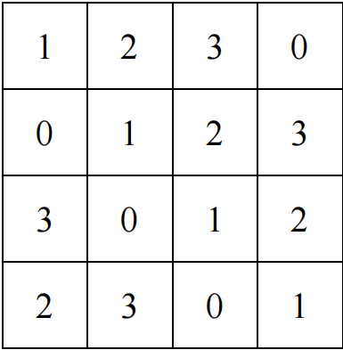
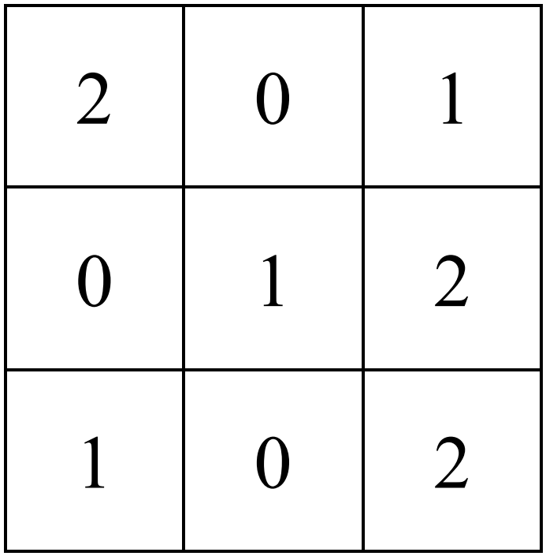
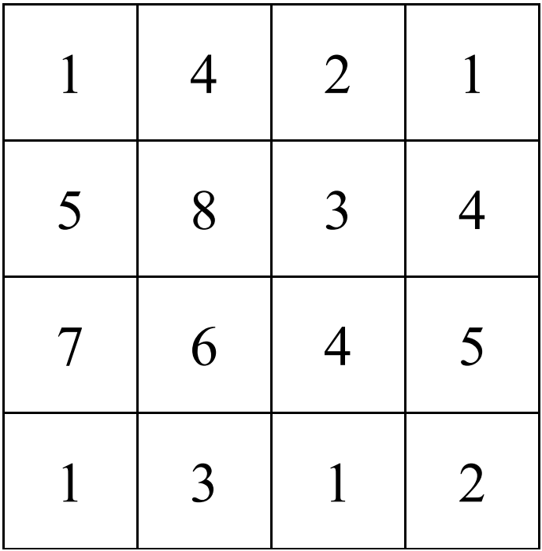

# HW3+2253744+林觉凯

> **Question1: ** **Briefly** answer the following questions:
>
> (1) Why do neural networks need activation functions?
>
> (2) Briefly describe the influence of the value of the learning rate on the training of the neural network.
>
> (3) What advantages does CNN have over fully connected DNN in image classification?

+ **Why do neural networks need activation functions?**

  + **Introducing non-linearity to enhance expressive power**

    The primary role of activation functions is to introduce non-linearity into neural networks. Without activation functions, no matter how many layers the network has, it would still be a linear transformation and unable to model complex real-world problems. Through non-linear transformations, neural networks can learn and approximate any complex function, making them suitable for tasks like image recognition and language understanding.

  + **Extracting deep features to improve learning capability**

    Activation functions enable neural networks to extract useful features from data layer by layer. Each layer applies a non-linear activation to transform the input into more abstract representations, building a comprehensive understanding of the task. For example, in image processing, networks identify edges, shapes, and eventually objects; in language tasks, they move from words to semantics—all relying on non-linear activations.

  + **Improving training efficiency and generalization**

    Certain activation functions, such as ReLU, output zero for negative inputs, causing some neurons to remain inactive under certain inputs. This introduces sparsity in the network, which reduces computation and helps prevent overfitting, thereby improving performance on unseen data. Additionally, well-chosen activation functions can improve gradient flow, making training more stable and efficient.

+ **Briefly describe the influence of the value of the learning rate on the training of the neural network.**

  The learning rate is one of the most critical hyperparameters in neural network training. It determines the step size of each gradient update. Different values of the learning rate can significantly affect the training speed, stability, and final performance of the model. The main impacts are as follows:

  + **Convergence Speed**

    The learning rate directly affects how fast the model converges. A higher learning rate allows the model to approach the optimal solution more quickly, speeding up training. In contrast, a lower learning rate results in slower updates and longer training time, but usually offers more stability.

  + **Stability and Accuracy**

    An excessively high learning rate may cause the model to oscillate around the optimal point or even diverge, preventing convergence. A lower learning rate enables finer weight adjustments, enhancing training stability and accuracy, but may cause the model to get stuck in local minima and affect the final result.

  + **Training Dynamics and Generalization**

    With a high learning rate, the loss function often fluctuates significantly, and the training process can be erratic or unstable. A low learning rate leads to a smoother and more gradual decrease in loss, helping the model optimize step by step. This often contributes to better generalization on unseen data.

+ **What advantages does CNN have over fully connected DNN in image classification?**

  + **Fewer Parameters and Lower Computational Complexity**

    Unlike fully connected layers where each neuron is connected to every input pixel, CNNs use weight sharing in convolutional filters. This dramatically reduces the number of trainable parameters, making the model more efficient and faster to train. Fewer parameters also reduce the risk of overfitting, especially when training on smaller datasets.

  + **Capturing Local Features and Spatial Hierarchies**

    CNNs use convolutional layers that operate on small regions of the image, enabling them to effectively capture local features such as edges, textures, and simple patterns. As the network goes deeper, it combines these low-level features to form more abstract and complex representations, building a hierarchical understanding of the image content. This localized processing is something fully connected DNNs lack.

  + **Translation Invariance and Robustness**

    CNNs are inherently more robust to translations and small shifts in the input image. This means they can still recognize an object even if it appears in a different position within the image. This spatial invariance is achieved through the use of convolution and pooling operations, which aggregate features across spatial locations.

  + **Better Use of Structural Information**

    CNNs preserve the spatial relationships between pixels by considering the two-dimensional structure of images. This allows them to learn patterns that are spatially meaningful, unlike DNNs that treat each pixel independently and ignore the geometric layout of the data.

  + **Higher Accuracy and Generalization**

    Thanks to their architecture and efficiency in feature extraction, CNNs usually achieve higher classification accuracy on image datasets compared to fully connected DNNs. Moreover, their ability to learn hierarchical representations helps them generalize better to new, unseen images.


****

> **Question2: **The input size of AlexNet is 227×227×3. Given CONV1: (CONV1): 96 11x11 filters at stride 4, pad 0. What is the output size after CONV1? Write out the calculation process.

The calculation formula for the output size of the convolutional layer is as follows:

+ Input width $W_{\text{in}}=227$
+ Input height $H_{\text{in}}=227$
+ Convolution kernel size $F=11$
+ pad $P=0$
+ stride $S=4$

$$
W_{\text{out}} = \left\lfloor \frac{W_{\text{in}} - F + 2P}{S} \right\rfloor + 1= \left\lfloor \frac{227 - 11 + 2 \times 0}{4} \right\rfloor + 1 = 55\\
H_{\text{out}} = \left\lfloor \frac{H_{\text{in}} - F + 2P}{S} \right\rfloor + 1= \left\lfloor \frac{227 - 11 + 2 \times 0}{4} \right\rfloor + 1 = 55\\
$$

The number of output channels is equal to the number of convolution kernels, that is, 96.

So the output size of the CONV1 layer is: $55 \times55\times96$.

**Code program for Question2:**

```python
def calculate_conv_output_size(input_size, filter_size, stride, padding):
    """
    Calculate the output size of a convolutional layer
    
    Parameters:
    input_size -- Input size (height, width, channel number)
    filter_size -- Filter size (height, width)
    stride -- Stride
    padding -- Padding
    
    Returns:
    Output size (height, width)
    """
    input_height, input_width, _ = input_size
    filter_height, filter_width = filter_size
    
    output_height = (input_height - filter_height + 2 * padding) // stride + 1
    output_width = (input_width - filter_width + 2 * padding) // stride + 1
    
    return output_height, output_width

# AlexNet parameters
input_size = (227, 227, 3)  # Input size
filter_size = (11, 11)      # Filter size
num_filters = 96            # Number of filters
stride = 4                  # Stride
padding = 0                 # Padding

# Calculate CONV1 output size
output_height, output_width = calculate_conv_output_size(input_size, filter_size, stride, padding)
output_depth = num_filters  # Output depth equals the number of filters

print("Input size: {}x{}x{}".format(*input_size))
print("CONV1 parameters: {} {}x{} filters, stride {}, padding {}".format(num_filters, *filter_size, stride, padding))
print("CONV1 output size: {}x{}x{}".format(output_height, output_width, output_depth))
```

**Program output for Question2:**

```bash
Input size: 227x227x3
CONV1 parameters: 96 11x11 filters, stride 4, padding 0
CONV1 output size: 55x55x96
```


****

> **Question3: **Convolution and Pooling Operations：
>
> (1) The 4×4 feature map is convolved with a 3×3 convolution kernel (stride = 1). 
>
> ​	Calculate feature maps output in both cases respectively:
>
> ​	a) No padding; 
>
> ​	b) 0 is padded around the feature map to keep the output feature size unchanged.	
>
> <figure style="display:flex; justify-content:center; gap:20px">
>   <div style="text-align:center">
>     
>     <figcaption style="text-align:center">Feature Map</figcaption>
>   </div>
>   <div style="text-align:center">
>     
>     <figcaption style="text-align:center">Kernel</figcaption>
>   </div>
> </figure>
>
> (2) The given feature maps are max-pooled and average-pooled respectively using a 2×2 pooling layer (stride = 2). Calculate the output feature map.
>
> <figure style="text-align:center">
>   
>   <figcaption style="text-align:center">Feature Map</figcaption>
> </figure>

(1) (a) In the absence of filling, output width and height:
$$
W_{\text{out}} = H_{\text{out}} = \frac{4 - 3}{1} + 1 = 2,\ the \ output\ is\ 2×2.
$$

$$
value_{[1,1]} &= 1 \times 2 + 2 \times 0 + 3 \times 1 + 0 \times 0 + 1 \times 1 + 2 \times 2 + 3 \times 1 + 0 \times 0 + 1 \times 2 = 15 \\
value_{[1,2]}&= 2 \times 2 + 3 \times 0 + 0 \times 1 + 1 \times 0 + 2 \times 1 + 3 \times 2 + 0 \times 1 + 1 \times 0 + 2 \times 2 = 16 \\
value_{[2,1]} &= 0 \times 2 + 1 \times 0 + 2 \times 1 + 3 \times 0 + 0 \times 1 + 1 \times 2 + 2 \times 1 + 3 \times 0 + 0 \times 2 = 6 \\
value_{[2,2]} &= 1 \times 2 + 2 \times 0 + 3 \times 1 + 0 \times 0 + 1 \times 1 + 2 \times 2 + 3 \times 1 + 0 \times 0 + 1 \times 2 = 15
$$

So the output of unfilled convolution is:
$$
\begin{bmatrix}
15 & 16\\
6 & 15
\end{bmatrix}
$$
(1) (b) 0 fill and keep the output size unchanged, To keep the output size at 4×4, it is necessary to calculate the fill size P:
$$
W_{\text{out}} = \frac{W_{\text{in}} - F + 2P}{S} + 1=W_{\text{in}}  ⇒P=1
$$
So fill a circle of 0 around the input image:
$$
\begin{bmatrix}
0 & 0& 0& 0& 0& 0\\
0 & 1& 2& 3& 0& 0\\
0 & 0& 1& 2& 3& 0\\
0 & 3& 0& 1& 2& 0\\
0 & 2& 3& 0& 1& 0\\
0 & 0& 0& 0& 0& 0\\
\end{bmatrix}
$$
Then calculate each position using convolution kernels and output a size of 4×4:
$$
value_{[1,1]} &= 0 \times 2 + 0 \times 0 + 0 \times 1 + 0 \times 0 + 1 \times 1 + 2 \times 2 + 0 \times 1 + 0 \times 0 + 1 \times 2 = 7 \\
value_{[1,2]} &= 0 \times 2 + 0 \times 0 + 0 \times 1 + 1 \times 0 + 2 \times 1 + 3 \times 2 + 0 \times 1 + 1 \times 0 + 2 \times 2 = 12 \\
value_{[1,3]} &= 0 \times 2 + 0 \times 0 + 0 \times 1 + 2 \times 0 + 3 \times 1 + 0 \times 2 + 1 \times 1 + 2 \times 0 + 3 \times 2 = 10 \\
value_{[1,4]} &= 0 \times 2 + 0 \times 0 + 0 \times 1 + 3 \times 0 + 0 \times 1 + 0 \times 2 + 2 \times 1 + 3 \times 0 + 0 \times 2 = 2 \\
value_{[2,1]} &= 0 \times 2 + 1 \times 0 + 2 \times 1 + 0 \times 0 + 0 \times 1 + 1 \times 2 + 0 \times 1 + 3 \times 0 + 0 \times 2 = 4 \\
value_{[2,2]} &= 1 \times 2 + 2 \times 0 + 3 \times 1 + 0 \times 0 + 1 \times 1 + 2 \times 2 + 3 \times 1 + 0 \times 0 + 1 \times 2 = 15 \\
value_{[2,3]} &= 2 \times 2 + 3 \times 0 + 0 \times 1 + 1 \times 0 + 2 \times 1 + 3 \times 2 + 0 \times 1 + 1 \times 0 + 2 \times 2 = 16 \\
value_{[2,4]} &= 3 \times 2 + 0 \times 0 + 0 \times 1 + 2 \times 0 + 3 \times 1 + 0 \times 2 + 1 \times 1 + 2 \times 0 + 0 \times 2 = 10 \\
value_{[3,1]} &= 0 \times 2 + 0 \times 0 + 1 \times 1 + 0 \times 0 + 3 \times 1 + 0 \times 2 + 0 \times 1 + 2 \times 0 + 3 \times 2 = 10 \\
value_{[3,2]} &= 0 \times 2 + 1 \times 0 + 2 \times 1 + 3 \times 0 + 0 \times 1 + 1 \times 2 + 2 \times 1 + 3 \times 0 + 0 \times 2 = 6 \\
value_{[3,3]} &= 1 \times 2 + 2 \times 0 + 3 \times 1 + 0 \times 0 + 1 \times 1 + 2 \times 2 + 3 \times 1 + 0 \times 0 + 1 \times 2 = 15 \\
value_{[3,4]} &= 2 \times 2 + 3 \times 0 + 0 \times 1 + 1 \times 0 + 2 \times 1 + 0 \times 2 + 0 \times 1 + 1 \times 0 + 0 \times 2 = 6 \\
value_{[4,1]} &= 0 \times 2 + 3 \times 0 + 0 \times 1 + 0 \times 0 + 2 \times 1 + 3 \times 2 + 0 \times 1 + 0 \times 0 + 0 \times 2 = 8 \\
value_{[4,2]} &= 3 \times 2 + 0 \times 0 + 1 \times 1 + 2 \times 0 + 3 \times 1 + 0 \times 2 + 0 \times 1 + 0 \times 0 + 0 \times 2 = 10 \\
value_{[4,3]} &= 0 \times 2 + 1 \times 0 + 2 \times 1 + 3 \times 0 + 0 \times 1 + 1 \times 2 + 0 \times 1 + 0 \times 0 + 0 \times 2 = 4 \\
value_{[4,4]} &= 1 \times 2 + 2 \times 0 + 0 \times 1 + 0 \times 0 + 1 \times 1 + 0 \times 2 + 0 \times 1 + 0 \times 0 + 0 \times 2 = 3
$$
The final output matrix of 4×4 obtained is as follows:
$$
\begin{bmatrix}
7 & 12& 10& 2\\
4 & 15& 16& 10\\
10 & 6& 15& 6\\
8 & 10& 4& 3\\
\end{bmatrix}
$$
(2) (a) Max Pooling:
$$
value_{[1,1]} &= max(1, 4, 5, 8) = 8 \\
value_{[1,2]} &= max(2, 1, 3, 4) = 4 \\
value_{[2,1]} &= max(7, 6, 1, 3) = 7 \\
value_{[2,2]} &= max(4, 5, 1, 2) = 5
$$
So the output of max-pooled:
$$
\begin{bmatrix}
8 & 4\\
7 & 5\\
\end{bmatrix}
$$
(2) (b) Average-pooled:
$$
value_{[1,1]} &= average(1, 4, 5, 8) = 4.5 \\
value_{[1,2]} &= average(2, 1, 3, 4) = 2.5 \\
value_{[2,1]} &= average(7, 6, 1, 3) = 4.25 \\
value_{[2,2]} &= average(4, 5, 1, 2) = 3
$$
So the output of average-pooled:
$$
\begin{bmatrix}
4.5 & 2.5\\
4.25 & 3\\
\end{bmatrix}
$$
**Code program for Question3:**

```python
import numpy as np

def convolution_2d(feature_map, kernel, stride=1, padding=0):
    """
    Perform 2D convolution operation
    
    Parameters:
    feature_map -- Input feature map
    kernel -- Convolution kernel
    stride -- Stride
    padding -- Padding size
    
    Returns:
    Output feature map
    """
    # Get the dimensions of the feature map and kernel
    fm_height, fm_width = feature_map.shape
    k_height, k_width = kernel.shape
    
    # Add padding if necessary
    if padding > 0:
        padded_feature = np.pad(feature_map, ((padding, padding), (padding, padding)), 'constant', constant_values=0)
    else:
        padded_feature = feature_map.copy()
    
    # Calculate the dimensions of the output feature map
    output_height = (padded_feature.shape[0] - k_height) // stride + 1
    output_width = (padded_feature.shape[1] - k_width) // stride + 1
    
    # Initialize the output feature map
    output = np.zeros((output_height, output_width))
    
    # Perform the convolution operation
    for i in range(0, output_height):
        for j in range(0, output_width):
            # Extract the current window
            window = padded_feature[i*stride:i*stride+k_height, j*stride:j*stride+k_width]
            # Calculate the convolution result
            output[i, j] = np.sum(window * kernel)
    
    return output

def pooling_2d(feature_map, pool_size=2, stride=2, mode='max'):
    """
    Perform 2D pooling operation
    
    Parameters:
    feature_map -- Input feature map
    pool_size -- Pooling window size
    stride -- Stride
    mode -- Pooling mode ('max' or 'avg')
    
    Returns:
    Output feature map
    """
    # Get the dimensions of the feature map
    fm_height, fm_width = feature_map.shape
    
    # Calculate the dimensions of the output feature map
    output_height = (fm_height - pool_size) // stride + 1
    output_width = (fm_width - pool_size) // stride + 1
    
    # Initialize the output feature map
    output = np.zeros((output_height, output_width))
    
    # Perform the pooling operation
    for i in range(0, output_height):
        for j in range(0, output_width):
            # Extract the current window
            window = feature_map[i*stride:i*stride+pool_size, j*stride:j*stride+pool_size]
            # Calculate the pooling result based on the mode
            if mode == 'max':
                output[i, j] = np.max(window)
            elif mode == 'avg':
                output[i, j] = np.mean(window)
    
    return output

# Feature map and kernel for question (1)
feature_map_1 = np.array([
    [1, 2, 3, 0],
    [0, 1, 2, 3],
    [3, 0, 1, 2],
    [2, 3, 0, 1]
])

kernel = np.array([
    [2, 0, 1],
    [0, 1, 2],
    [1, 0, 2]
])

# (1) a) Convolution without padding
output_no_padding = convolution_2d(feature_map_1, kernel, stride=1, padding=0)

# (1) b) Convolution with padding to keep the output size unchanged
padding_size = kernel.shape[0] // 2  # To keep the output size unchanged
output_with_padding = convolution_2d(feature_map_1, kernel, stride=1, padding=padding_size)

# Feature map for question (2)
feature_map_2 = np.array([
    [1, 4, 2, 1],
    [5, 8, 3, 4],
    [7, 6, 4, 5],
    [1, 3, 1, 2]
])

# (2) Max pooling and average pooling
output_max_pooling = pooling_2d(feature_map_2, pool_size=2, stride=2, mode='max')
output_avg_pooling = pooling_2d(feature_map_2, pool_size=2, stride=2, mode='avg')

# Print the results
print("Question (1):")
print("a) Convolution without padding result:")
print(output_no_padding)
print("\nb) Convolution with padding result:")
print(output_with_padding)

print("\nQuestion (2):")
print("Max pooling result:")
print(output_max_pooling)
print("\nAverage pooling result:")
print(output_avg_pooling)
```

**Program output for Question3:**

```bash
Question (1):
a) Convolution without padding result:
[[15. 16.]
 [ 6. 15.]]

b) Convolution with padding result:
[[ 7. 12. 10.  2.]
 [ 4. 15. 16. 10.]
 [10.  6. 15.  6.]
 [ 8. 10.  4.  3.]]

Question (2):
Max pooling result:
[[8. 4.]
 [7. 5.]]

Average pooling result:
[[4.5  2.5 ]
 [4.25 3.  ]]
```